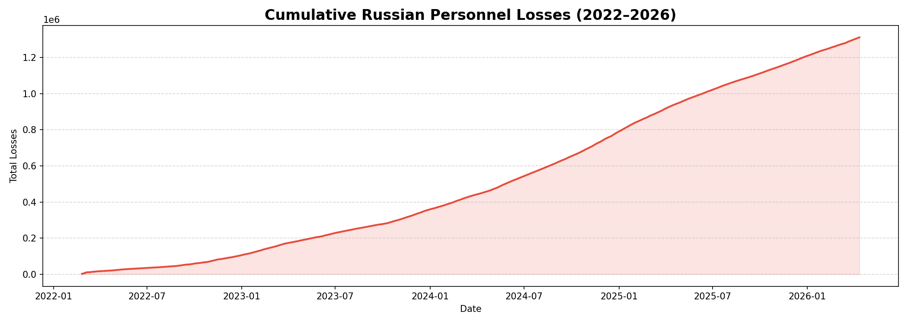
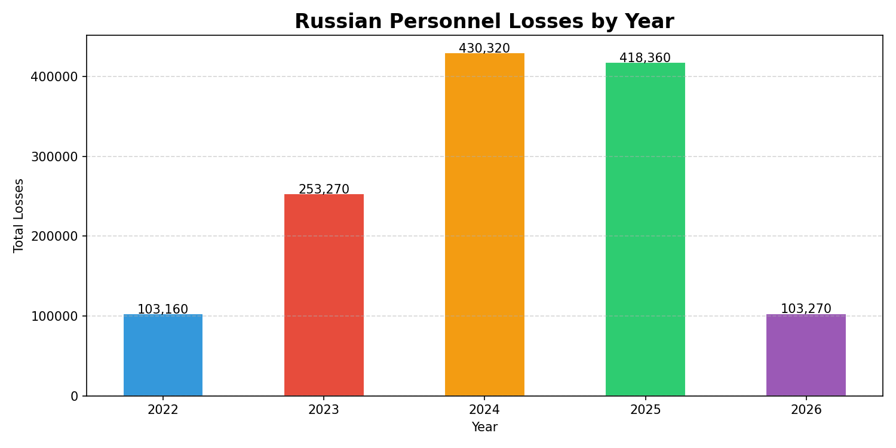
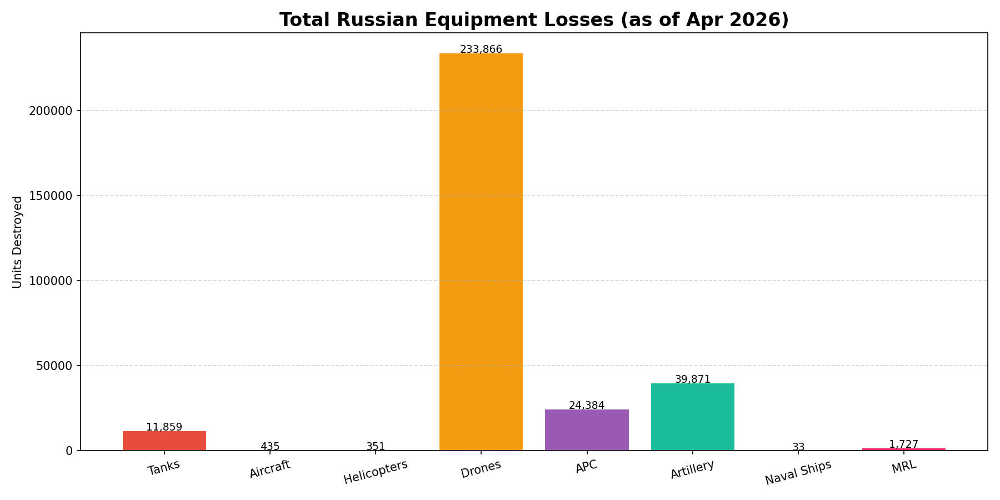
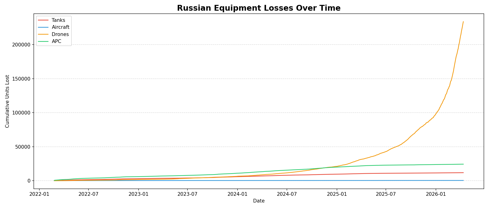

# Russia-Ukraine-War-Analysis
#  Russia-Ukraine War — Military Losses Analysis
### SQL + Python + Power BI

## Overview
End-to-end data analysis project tracking Russian military 
losses during the Ukraine-Russia war from February 2022 
to April 2026 (1,509 days of conflict).

## Tools Used
- SQLite (data querying & aggregation)
- Python (EDA & visualizations)
- Power BI (interactive dashboard)
- Google Colab (development environment)

## Dataset
- Source: Kaggle — Ukraine War Dataset
- Tables: russia_losses_equipment, russia_losses_personnel
- Records: 1,509 days of daily loss data

## Project Structure
- SQL queries → data extraction & aggregation
- Python EDA → trend analysis & visualizations
- Power BI → 4 page interactive dashboard

## Key Findings
- 1.3M+ total Russian casualties over 1,509 days
- Average 867 casualties per day
- 12,000+ tanks destroyed
- 234,000+ drones destroyed
- 435 aircraft destroyed
- 33 naval ships lost
- 2024 recorded highest daily loss rate

## Dashboard Pages
1. War Overview — KPIs, cumulative trends
2. Personnel Analysis — yearly & daily losses
3. Equipment Analysis — tanks, aircraft, drones
4. Key Insights — summary statistics & top loss days

## Visualizations

### Personnel Losses Trend

### Yearly Losses Comparison

### Equipment Losses Breakdown

### Equipment Timeline

